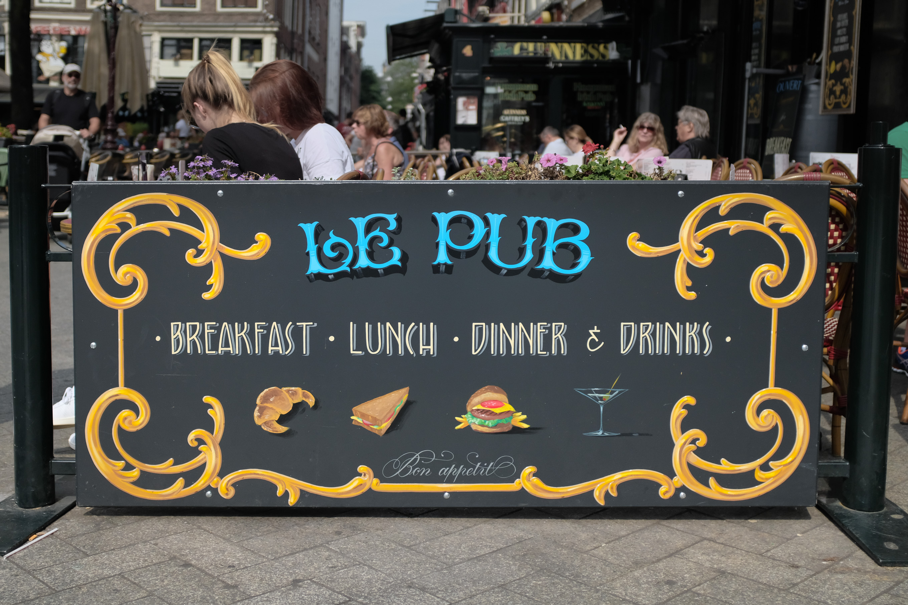
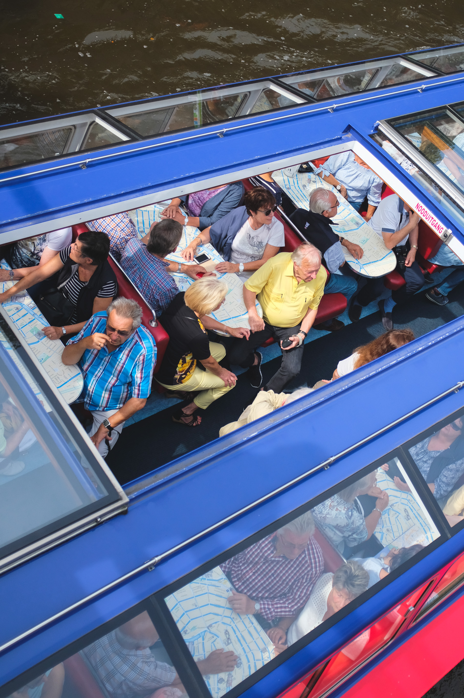
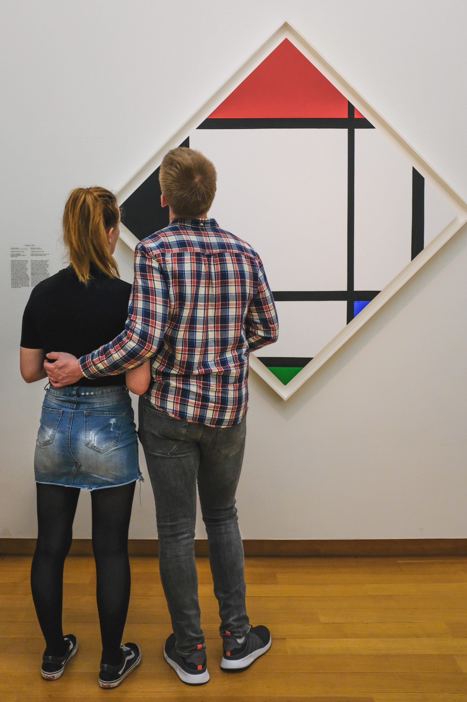
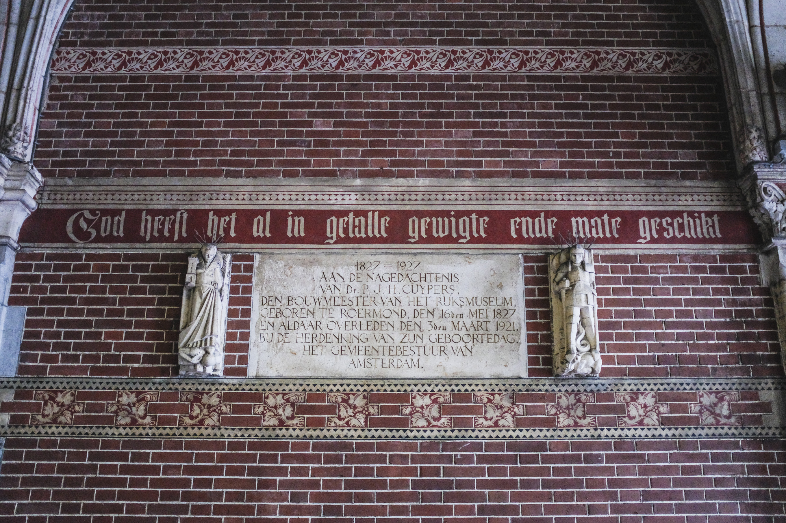
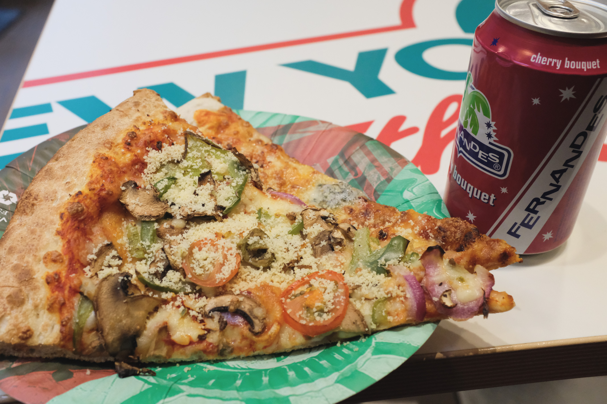
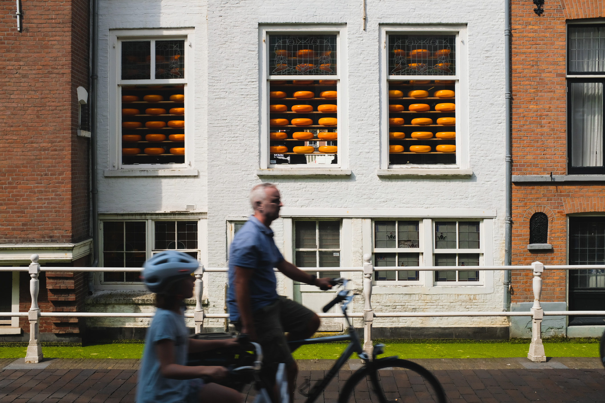

I'm extremely grateful to be able to live in the Netherlands for almost a year, in part because it gives me the chance to travel to Dutch cities in a way other than the _go-all-day-long-and-take-it-all-in_ mode I am used to when traveling. I was able to take two casual trips in August – one to Amsterdam, with the main purpose of seeing the Stedelijk Museum (sort of the MoMA of Holland), and another to Delft, with the main purpose of walking around and seeing some canals (we also visited a garden and ate some sandwiches – very productive).

## Amsterdam

Above: formerly the main post office of Amsterdam, this ornate building is now the [The Magna Plaza Shopping Center](https://en.wikipedia.org/wiki/Magna_Plaza).

We stepped into a a boutique bike shop, [Kimura](https://www.facebook.com/kimurabike/), had amazing bikes and frames. This fixie had the charming little detail of Felix the Cat, carrying a lit bomb – which I've only just learned is borrowed from the [US Navy air fighter squadron VFA-31](https://en.wikipedia.org/wiki/VFA-31) (thanks, Google and Wikipedia!).

Visiting European cities like Amsterdam (Berlin is even better for this) gives reassurance that in some corners, punk is still alive. 

Biking is really, really popular here. An amazing 57% of the city's population uses a bicycle on a daily basis, with 43% commuting to work by bicycle, and in a city of 780,000, there are 881,000 bikes ([source](https://www.citylab.com/transportation/2015/02/amsterdam-has-officially-run-out-of-spaces-to-park-its-bicycles/385867/). That is to say, we came across more than one bike shop.

The first time I visited Amsterdam, I was amazed by just how many canals there were. I am still amazed by it. New York is to pizza places and fancy coffee as Amsterdam is to canals. Walk a block perpendicular to one canal, and you are probably crossing another. Take a look:

<iframe src="https://www.google.com/maps/embed?pb=!1m18!1m12!1m3!1d19496.539730237702!2d4.886410503621169!3d52.37337520633819!2m3!1f0!2f0!3f0!3m2!1i1024!2i768!4f13.1!3m3!1m2!1s0x47c609bb6821e9d3%3A0xd29b21b043cebd9b!2sCentrum%2C+Amsterdam!5e0!3m2!1sen!2snl!4v1505158769132" width="100%" height="500" frameborder="0" style="border:0" allowfullscreen></iframe>

Also like New York, Amsterdam has a sometimes overwhelming amount of tourists. Luckily, also like New York, that lends itself to some good signage.

At the [Stedelijk Museum](http://www.stedelijk.nl/en), we got to see samples from their huge collection of art from the past hundred years, sorted into prominent modern art movements. 

We also got to enjoy some engaging and entertaining contemporary artwork.

We didn't get to see the Rijks Museum on this trip, but I'll be back for that. We did, however, walk in the bicyclist and pedestrian tunnel that goes through the center of the building, and enjoy the gothic signage and architecture.

I haven't gone this long without pizza in years, so I pulled my travel partner into a _New York Pizza_ (a chain serving pizza that purports to be New York style). It was ... okay. I think this might be what people refer to as "cardboard" crust – somewhat dry and a bit tough to tear. Still, it had cheese and toppings, so it was a welcome meal. No doubt, I'll be back into a _New York Pizza_ in the near future (they also have a couple of locations in Den Haag), but I'm definitely looking forward to getting back to multiple slices a week from my Manhattan and Brooklyn favorites, next August.

## Delft

[Delft](https://en.wikipedia.org/wiki/Delft) is a smaller city, with a population of about 100,000. It's only about a 15-minute train ride to the southeast of Den Haag, so I joined a couple of classmates to take an afternoon trip there, with no plans in particular.

<iframe src="https://www.google.com/maps/embed?pb=!1m18!1m12!1m3!1d313707.3069895906!2d4.359577457793825!3d52.10087371553469!2m3!1f0!2f0!3f0!3m2!1i1024!2i768!4f13.1!3m3!1m2!1s0x47c5b5c3515f58fd%3A0x89b05ca3c54bd43d!2sDelft!5e0!3m2!1sen!2snl!4v1505159906704" width="100%" height="500" frameborder="0" style="border:0" allowfullscreen></iframe>

One striking thing about the canals in the Netherlands this fall is that many are filled with duckweed, a tiny, vivid-green plant. Individual pieces of it are only about the size of an apple seed, but collectively, they can carpet entire waterways in a way that looks almost like a solid stretch of lawn. I don't know how typical this level of duckweed is, but it's somewhat incredible to see.

We walked amongst booths at an antique market, checking whether we could find any old books with lead-printed type (we will need three such books for a Type]Media class assignment, this fall semester).

The Dutch are famous for their cheese (Gouda is not only a delicious cheese, but also the town in South Holland which historically traded the cheese).

With no special plans in Delft, we made the decision to visit the botanic gardens. They were small as compared to some of the city gardens I've visited in the past (including the relatively massive ones in Denver, Minneapolis, Brooklyn, and the Bronx), but charming and beautiful. One fun inclusion was a small area which contained honeybee hives, as well as a small aviary.

_The gardens had some green house for tropical plants. Above is my roommate and classmate, Carlos._

_A cross-section of mangrove root._

After the gardens and a small, late lunch, we headed back to the Delft Centraal Station, to take a train home to Den Haag.
