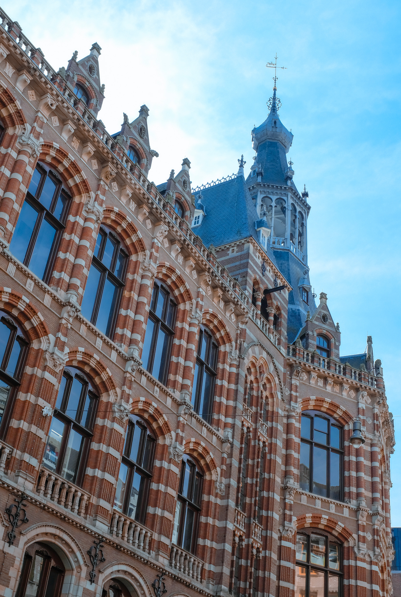
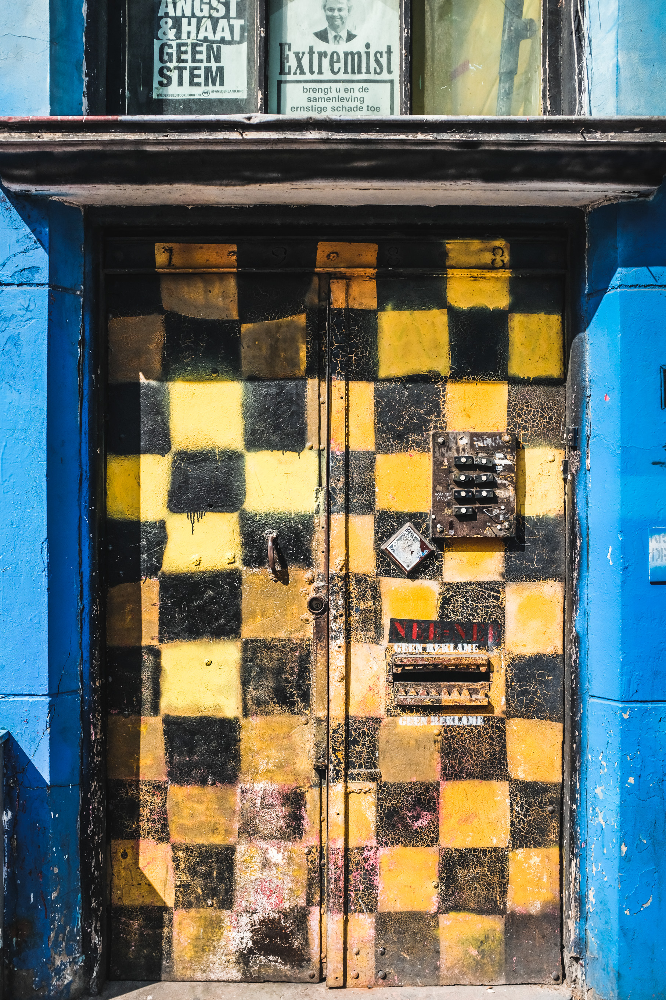
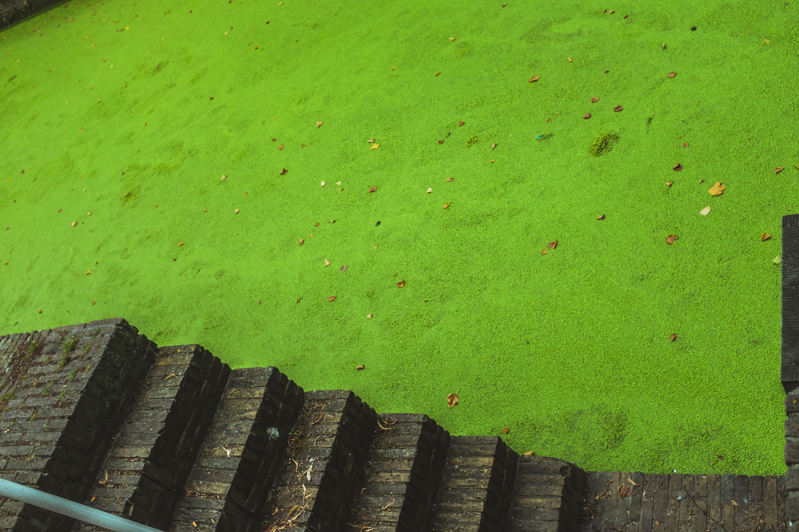

## Amsterdam

Formerly the main post office of Amsterdam, this ornate building is now the [The Magna Plaza Shopping Center](https://en.wikipedia.org/wiki/Magna_Plaza).

We stepped into a a boutique bike shop, [Kimura](https://www.facebook.com/kimurabike/), had amazing bikes and frames. This fixie had the charming little detail of Felix the Cat, carrying a lit bomb – which I've only just learned is borrowed from the [US Navy air fighter squadron VFA-31](https://en.wikipedia.org/wiki/VFA-31) (thanks, Google and Wikipedia!).

## Delft

